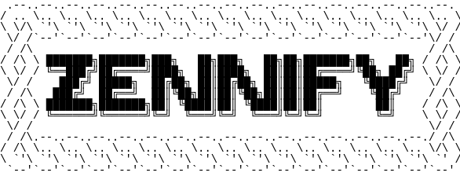

# Zennify

    
     
     
    
    
     
     
    <i>A hardcore, gamified productivity suite for deep work</i>

## Abstract

Zennify is a comprehensive, gamified productivity ecosystem built with Python and Flet. It integrates activity logging, spaced-repetition flashcards, hardcore todo management, and Pomodoro timers into a single, cohesive experience. By introducing a unified virtual economy, Zennify transforms mundane tasks into rewarding challenges, helping users maintain long-term focus and consistency.

## Objective

To provide a privacy-first, low-overhead productivity suite that leverages gamification and hardcore analytics to eliminate procrastination and foster deep work habits without relying on external cloud services.

## Features

### Functional

- **Activity Logger**: Automated interval-based logging with mandatory tagging and productivity multipliers.
- **Hardcore Todos**: Deadline-enforced task management where failure results in economic penalties.
- **SRS Flashcards**: Spaced-repetition revision system utilizing the FSRS v6 algorithm for optimized learning.
- **Pomodoro Engine**: Time-boxed focus sessions with detailed 24-hour distribution analytics.
- **Unified Economy**: Earn coins through productive work and spend them on custom rewards in the integrated Shop.
- **Bankruptcy Logic**: A high-stakes system that resets all progress and streaks if the user fails to maintain positive balance.

### Non Functional

- **Local-First Architecture**: All data resides in a local SQLite database, ensuring total privacy.
- **Modern Aesthetics**: Dark-themed, responsive UI designed for a distraction-free environment.
- **Minimal Overhead**: Lightweight execution with zero background telemetry or cloud dependencies.
- **Deep Analytics**: Advanced Matplotlib-powered insights into consistency, focus, and learning progress.

## Specifications

### Requirements

- **Operating System**: Linux (optimized) or Windows.
- **Python Version**: 3.12 or higher.
- **Storage**: Minimum 50MB free space for local database and configurations.

### Dependencies

- **flet**: Core UI framework.
- **matplotlib**: Data visualization and analytics.
- **sqlite3**: Local data persistence.

## Getting Started

> [!WARNING]  
> **Disclaimer:** This project was developed strictly for learning purposes and is not fully tested. Use it at your own risk. The author is not responsible for any issues, data loss, or system instability that may occur.

Installation and Usage Guidelines are inside the docs/begin.md file.

## License

MIT
