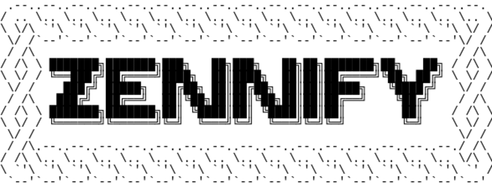

# Zennify

    
     
     
    
    
     
     
    <i>A hardcore, gamified productivity suite for deep work</i>

> [!NOTE]
> **Active Development:** This project is currently a work in progress and is being actively buil!

## Abstract

Zennify is a comprehensive, gamified productivity ecosystem built with Python and Flet. It integrates activity logging, spaced-repetition flashcards, hardcore todo management, and Pomodoro timers into a single, cohesive experience. By introducing a unified virtual economy, Zennify transforms mundane tasks into rewarding challenges, helping users maintain long-term focus and consistency.

## Objective

To provide a privacy-first, low-overhead productivity suite that leverages gamification and hardcore analytics to eliminate procrastination and foster deep work habits without relying on external cloud services.

## Features

### Functional
### Non Functional

## Specifications

### Requirements
### Dependencies

## Getting Started

Installation and Usage Guidelines are inside the docs/begin.md file.
